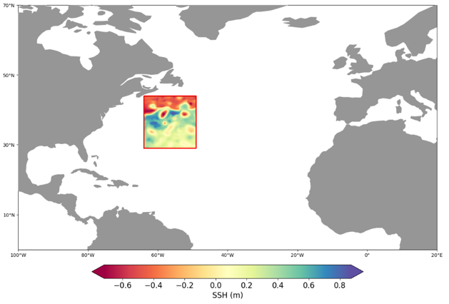

# 2023_SSH_mapping_train_eNATL60_test_NATL60

## Motivation

This datachallenge is based on the principle of the [SSH Mapping Data Challenge 2020a](https://github.com/ocean-data-challenges/2020a_SSH_mapping_NATL60). The aim is again to compare several methods for reconstructing sequences of Sea Surface Height (SSH) from partial satellite altimeter observations. As in the previous datachallenge, this datachallenge follows the framework of an OSSE (Observation System Simulation Experiment) where "Real" full SSH are from a numerical simulation with a realistic, high-resolution ocean circulation model: the reference simulation. However, this datachallenge proposes to use two separate reference simulations, each covering an entire year, whereas previous datachallenges only used a single simulation covering one year: a first simulation for training methods requiring learning from full SSH fields, and a second for evaluating different reconstruction methods over a full year. On the one hand, this approach enables a longer learning period: a whole year, whereas in previous data challenges, learning was limited to a few months to maintain an independent evaluation period within the same year. Secondly, SSH reconstructions can be validated on a full year of data, totally independent of the learning data, making it possible to study any seasonal effects in reconstruction performance.

## Design of experiment

### Reference simulations

The two references simulations used are the **NATL60-CJM165** and the **eNATL60-BLB002** simulations, both based on the NEMO model, tide-free, and with a nature run grid resolution of 1/60°.
- **NATL60-CJM165** covers the North Atlantic region, and provides hourly output data. For more detailed information, please visit this link: [NATL60-CJM165 Information](https://github.com/meom-configurations/NATL60-CJM165).
- **eNATL60-BLB002**: This simulation covers an extended area, including the tropical/equatorial Atlantic, the entire Mediterranean Sea, and the Black Sea. It offers a more realistic simulation, including surface pressure forcing, but it does not have the explicit resolution of tides. The nature run grid resolution is 1/60° with hourly output. You can find additional information at this link: [eNATL60 Information](https://github.com/ocean-next/eNATL60).

For convenience and memory consideration, we have reinterpolated both of these simulations onto two different grid resolutions: **1/20°** and **1/8°**. Additionally, we have provided **daily mean resampling** for these datasets.

### Observations

The SSH observations include simulations of seven altimeters data: Jason-3, Sentinel-3a, Sentinel-3b, Cryosat-2, Saral/Altika, Haiyang-2a, Haiyang-2b. This nadir altimeters constellation was operating during the 2019-2020 period. No observation error is considered in this challenge.

### Data sequence and use

The reconstruction of the SSH is evaluated on the **NATL60** domain over the whole year, which corresponds to the period from 2012-10-11 to 2013-09-20.

For reconstruction methods that require learning from complete SSH fields, training is carried out on the **eNATL60** domain over the whole year, which corresponds to the period from 2009-07-01 to 2010-06-30. The validation subset can be chosen from the latter.


Sub-periods are also considered for the evaluation: 40 days are chosen in the
middle of each season:


<!--
To highlight the particularities of the different seasons of the year, sub-periods of 40 days in the middle of each season are defined. In this situation, for learning-based methods, training on the X sub-periods of eNATL60 would naturally lead to the assessment of the model on X sub-periods of NATL60 or the whole domain

TODO: parler des sous-périodes (milieux de saisons)

- Hiver     : YYYY-02-01 à YYYY-03-13
- Printemps : YYYY-04-30 à YYYY-06-09
- Été       : YYYY-07-11 à YYYY-08-20
- Automne   : YYYY-10-21 à YYYY-11-30
-->
### Region of interest
The region of interest in this datachallenge is a region of the Gulf Stream current in the Norh Atlantic basin **[64°O x 49°O , 29°N x 44°N]**, referred to as **GF**. In this datachallenge, all the evaluation diagnoses of SSH reconstruction will be computed over this domain.



## Leaderboard
At the **1/8°** resolution:

| Method   |   Period   | µ(RMSE) | σ(RMSE) | λx (°) | λt (days) | Domain | Reference |
| -------- | ---------- | ------- | ------- | -----  | --------- | ------ | --------- |
| 4DVarNet | Whole year | 0.94  | 0.01  | 1.11 | 9.04  | GF | eval_4dvarnet_1_8.ipynb |
|          | Mid_autumn | 0.952 | 0.007 | 1.26 | 8.93  |    |                     |
|          | Mid_winter | 0.935 | 0.007 | 1.15 | 7.43  |    |                     |
|          | Mid_spring | 0.932 | 0.01  | 1.08 | 9.81  |    |                     |
|          | Mid_summer | 0.936 | 0.006 | 1.25 | 6.85  |    |                     |
| MIOST    | Whole year | 0.927 | 0.011 | 1.23 | 13.39 | GF | eval_miost_1_8.ipynb    |
|          | Mid_autumn | 0.941 | 0.008 | 1.36 | 10.21 |    |                     |
|          | Mid_winter | 0.926 | 0.007 | 1.41 | 8.14  |    |                     |
|          | Mid_spring | 0.921 | 0.011 | 1.31 | 10.47 |    |                     |
|          | Mid_summer | 0.923 | 0.007 | 1.58 | 10.03 |    |                     |

At the **1/20°** resolution:


| Method   |   Period   | µ(RMSE) | σ(RMSE) | λx (°) | λt (days) | Domain | Reference |
| -------- | ---------- | ------- | ------- | -----  | --------- | ------ | --------- |
| 4DVarNet | Whole year | 0.944 | 0.009 | 1.00  | 8.42 | GF | eval_4dvarnet_1_20.ipynb |
|          | Mid_autumn | 0.956 | 0.005 | 1.21  | 8.08 |    |                          |
|          | Mid_winter | 0.941 | 0.006 | 1.24  | 7.85 |    |                          |
|          | Mid_spring | 0.937 | 0.009 | 1.18  | 9.51 |    |                          |
|          | Mid_summer | 0.941 | 0.005 | 1.20  | 7.16 |    |                          |
| MIOST    | Whole year | 0.926 | 0.011 | 1.32  | 13.39 | GF | eval_miost_1_20.ipynb    |
|          | Mid_autumn | 0.941 | 0.008 | 1.37  | 10.22 |    |                          |
|          | Mid_winter | 0.926 | 0.007 | 1.43  | 8.15  |    |                          |
|          | Mid_spring | 0.921 | 0.011 | 1.32  | 10.44 |    |                          |
|          | Mid_summer | 0.923 | 0.007 | 1.57  | 10.04 |    |                          |

With:
- µ(RMSE): average RMSE score;
- σ(RMSE): standard deviation of the RMSE score;
- λx: minimum spatial scale resolved;
- λt: minimum temporal scale resolved.

## Data

### Data description
The data are available with the following repository structure:
```
|-- dc_ref
|   |-- eNATL60-BLB002-daily-reg-1_20.nc
|   |-- eNATL60-BLB002-daily-reg-1_8.nc
|   |-- NATL60-CJM165-daily-reg-1_20.nc
|   |-- NATL60-CJM165-daily-reg-1_8.nc
|-- dc_obs
|   |-- eNATL60-BLB002-alongtrack.gz
|   |-- NATL60-CJM165-alongtrack.gz
```
In the ```dc_ref``` repository, daily mean resampling of the reference simulations variables are provided for both **eNATL60-BLB002** and **NATL60-CJM165** : at the **1/8°** (```*-*-daily-reg-1_8.nc```) and the **1/20°** (```*-*-daily-reg-1_20.nc```) resolution grid.

In the ```dc_obs``` repository, the **alongtrack** files (```*-*-alongtrack.gz```) store the simulated SSH observations. For both **eNATL60-BLB002** and **NATL60-CJM165** simulations,  the variables are interpolated onto the **2019-2020 nadir altimeter constellation** available in CMEMS, i.e., Jason-3, Sentinel-3a, Sentinel-3b, Cryosat-2, Saral/Altika, Haiyang-2a, Haiyang-2b.

- For the **NATL60-CJM165** datasets, you will find the following variables:
  ```
  coordinates:
      lat: latitude vector [degree north]
      lon: longitude vector [degree east]
      time: time vector [date time]
  ```
  ```
  variables:
      ssh: sea surface height simulated by the model [meters]
      mdt: mean dynamic topography, computed as the temporal averaged simulated ssh [meters]
      ssh_variance: variance map of the ssh variable [meters²]
      sla: sea level anomaly, computed as: sla = ssh - mdt [meters]
      ssh_norm: normalized ssh (using fir 4dvarnet mapping), computed as: ssh_norm = sla/sqrt(ssh_variance) [no unit]
  ```

- For the **eNATL60-BLB002** dataset, you will find the following variables:
  ```
  coordinates:
      lat: latitude vector [degree north]
      lon: longitude vector [degree east]
      time: time vector [date time]
  ```
  ```
  variables:
      ssh_model_with_HF: sea surface height simulated by the model [meters]
      ssh: sea surface height simulated by the model without high frequency signal, i.e., with DAC ERA-INTERIM ssh signal removed and 25h temporal filtering to remove residual tidal effects [meters]
      mdt: mean dynamic topography, computed as the temporal averaged simulated ssh [meters]
      ssh_variance: variance map of the ssh variable [meters²]
      sla: sea level anomaly, computed as: sla = ssh - mdt [meters]
      ssh_norm: normalized ssh (using fir 4dvarnet mapping), computed as: ssh_norm = sla/sqrt(ssh_variance) [no unit]
  ```
### Download the data

The datasets of simulations daily mean resampling are available at the following links:
- **eNATL60-BLB002** (1/20°):
    ```
    https://s3.eu-central-1.wasabisys.com/melody/data_challenge_Daniel_Guillaume/public/dc_ref/eNATL60-BLB002-daily-reg-1_20.nc
    ```
- **eNATL60-BLB002** (1/8°):
    ```
    https://s3.eu-central-1.wasabisys.com/melody/data_challenge_Daniel_Guillaume/public/dc_ref/eNATL60-BLB002-daily-reg-1_8.nc
    ```
- **NATL60-CJM165** (1/20°) - *for evaluation*:
    ```
    https://s3.eu-central-1.wasabisys.com/melody/data_challenge_Daniel_Guillaume/public/dc_ref/NATL60-CJM165-daily-reg-1_20.nc
    ```
- **NATL60-CJM165** (1/8°) - *for evaluation*:
    ```
    https://s3.eu-central-1.wasabisys.com/melody/data_challenge_Daniel_Guillaume/public/dc_ref/NATL60-CJM165-daily-reg-1_8.nc
    ```

The alongtrack files are archived in zip format as they contain a lot of files. They are available at the following links:

- **eNATL60-BLB002 alongtracks**:
    ```
    https://s3.eu-central-1.wasabisys.com/melody/data_challenge_Daniel_Guillaume/public/dc_obs/eNATL60-BLB002-alongtrack.gz
    ```
- **NATL60-CJM165 alongtracks**:
    ```
    https://s3.eu-central-1.wasabisys.com/melody/data_challenge_Daniel_Guillaume/public/dc_obs/NATL60-CJM165-alongtrack.gz
    ```

To download a file, you can use the `wget` command. For example, if you want to download NATL60-CJM165 with a resolution of 1/8°:
```sh
wget https://s3.eu-central-1.wasabisys.com/melody/data_challenge_Daniel_Guillaume/public/dc_ref/NATL60-CJM165-daily-reg-1_8.nc
```
To extract an archive in the same directory, use the `tar` command. For example, if you want to download NATL60's alongtrack and extract it from its archive:
```sh
wget https://s3.eu-central-1.wasabisys.com/melody/data_challenge_Daniel_Guillaume/public/dc_obs/NATL60-CJM165-alongtrack.gz

tar -zxvf NATL60-CJM165-alongtrack.gz
```


### Prepare the data

For mapping methods that take as input **gridded observations** instead of raw along tracks, we provide a **binning** script ```alongtrack_binning.ipynb```, that interpolates simulated along tracks observations on a daily grid whose spatial resolution is left to the user's choice (1/8° or 1/20°).
