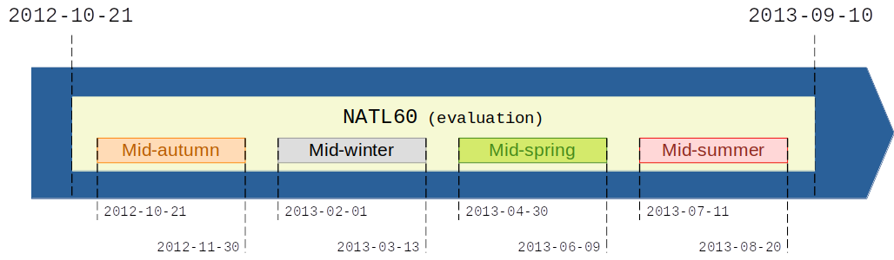

# 2023_SSH_mapping_train_eNATL60_test_NATL60

### Motivation 

This datachallenge is based on the principle of the https://github.com/ocean-data-challenges/2020a_SSH_mapping_NATL60 datachallenge. The aim is again to compare several methods for reconstructing sequences of Sea Surface Height (SSH) from partial satellite altimeter observations. As in the previous datachallenge, this datachellenge follows the framework of an OSSE (Observation System Simulation Experiment) where "Real" full SSH are from a numerical simulation with a realistic, high-resolution ocean circulation model: the reference simulation. However, this datachallenge proposes to use two separate reference simulations, each covering an entire year, whereas previous datachallenges only used a single simulation covering one year: a first simulation for training methods requiring learning from full SSH fields, and a second for evaluating different reconstruction methods over a full year. On the one hand, this approach enables a longer learning period: a whole year, whereas in previous data challenges, learning was limited to a few months to maintain an independent evaluation period within the same year. Secondly, SSH reconstructions can be validated on a full year of data, totally independent of the learning data, making it possible to study any seasonal effects in reconstruction performance.  

### Reference simulations 

The two references simulations used are the NATL60 and eNATL60 simulations both based on the NEMO model. Both simulations are run with a 1/60° horizontal resolution, and without tidal forcing. The simulations are here downgraded to the resolution of 1/8° and 1/20° for memory consideration. TODO: Ajouter des références pour les deux simulations.

### Observations

The SSH observations include simulations of seven altimeters data: Altika, CryoSat-2, HaiYang-2Ag, HaiYang-2B, Jason 3, Sentinel-3a, and Sentinel-3b. This nadir altimeters constellation is operating since 2019. No observation error is considered in this challenge.

### Data sequence and use

The reconstruction of the SSH is evaluated on the **NATL60** domain over the whole year, which corresponds to the period from 2012-10-01 to 2013-09-30.

For reconstruction methods that require learning from complete SSH fields, training is carried out on the **eNATL60** domain over the whole year, which corresponds to the period from 2009-07-01 to 2010-06-30. The validation subset can be chosen from the latter.

Sub-periods are also considered for the evaluation: 40 days are chosen in the
middle of each season:

<!--
To highlight the particularities of the different seasons of the year, sub-periods of 40 days in the middle of each season are defined. In this situation, for learning-based methods, training on the X sub-periods of eNATL60 would naturally lead to the assessment of the model on X sub-periods of NATL60 or the whole domain

TODO: parler des sous-périodes (milieux de saisons)

- Hiver     : YYYY-02-01 à YYYY-03-13
- Printemps : YYYY-04-30 à YYYY-06-09
- Été       : YYYY-07-11 à YYYY-08-20
- Automne   : YYYY-10-21 à YYYY-11-30
-->

## Leaderboard

| Method | µ(RMSE) | σ(RMSE) | λx (°) | λt (days) | Notes | Reference |
| ------ | ------- | ------- | ------ | --------- | ----- | --------- |
| MIOST  | . | . | . | . | . | . |
| 4DVarNet-NATL  | . | . | . | . | . | . |
| 4DVarNet-GF  | . | . | . | . | . | . |
| etc  | . | . | . | . | . | . |

With:
- µ(RMSE): average RMSE score;
- σ(RMSE): standard deviation of the RMSE score;
- λx: minimum spatial scale resolved;
- λt: minimum temporal scale resolved.
